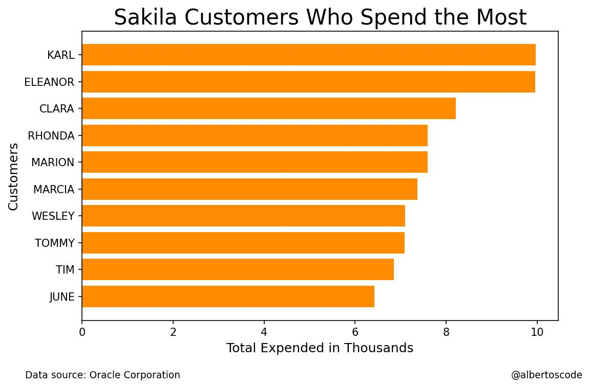

# Customer Expenditure Analysis based on data queried from the Sakila sample database version 1.2

## Chart

## References

Hunter, J. (2007). Matplotlib: A 2D graphics environment. IEEE COMPUTER SOC.

Kanz, A. (2020). Klib.

Kluyver, T., Ragan-Kelley, B., Perez, F., Granger, B., Bussonnier, M., & Frederic, J. et al. (2016). Jupyter Notebooks - a publishing format for reproducible computational workflows. In Positioning and Power in Academic Publishing: Players, Agents and Agendas (pp. 87-90). Netherlands; IOS Press. Retrieved 19 May 2022, from https://eprints.soton.ac.uk/403913/.

Oracle Corporation. (2019). Sakila sample database. Oracle Corporation.

The pandas development team. (2020). pandas-dev/pandas: Pandas. Zenodo.

van Rossum, G. (1991). Python. Python Software Foundation.

## Author

Alberto

- [@albertoscode](https://github.com/albertoscode)

## Feedback

If you have any feedback, please write to the following email address: ah8664383@gmail.com

